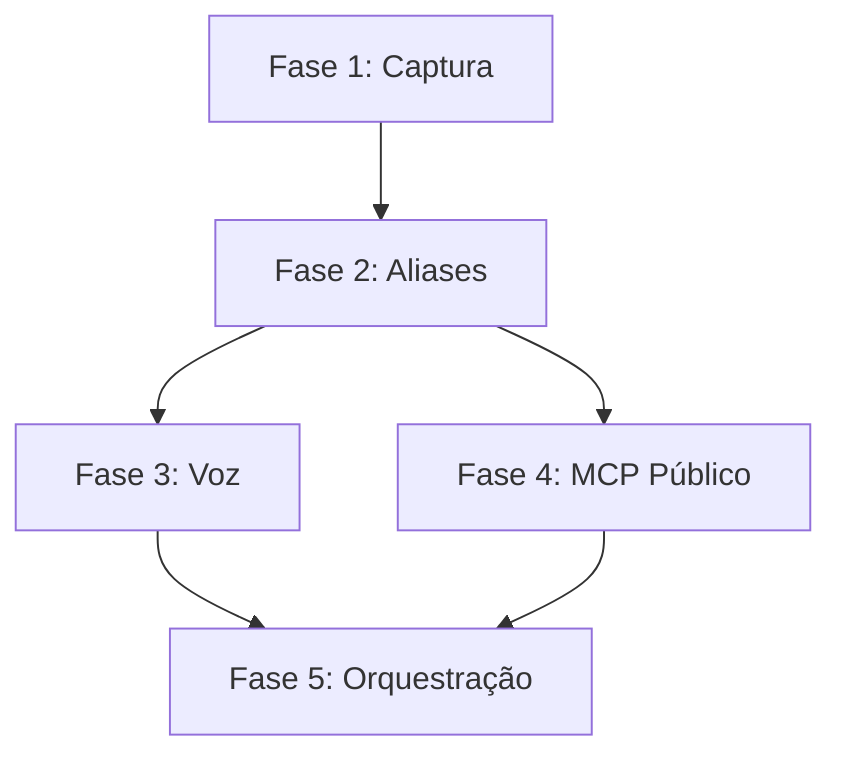

# 🗺️ ROADMAP - METODOLOGIA SCRAPE

**Projeto:** Metodologia-Scrape  
**Objetivo:** Framework opensource para scraping de conversas Grok Share + Sistema JARVIS-like  
**Owner:** Deivison Santana (@deivisan)  
**Início:** Dezembro 2025  
**Status:** ⏳ Fase 2 em andamento

---

## 🎯 VISÃO GERAL

Criar sistema completo de **captura, processamento e orquestração** de conversas do Grok (X.com), culminando em assistente pessoal **JARVIS-like** com:

- ✅ Scraping robusto (Puppeteer Stealth)
- ✅ MCP (Model Context Protocol) para persistência
- ⏳ Sistema de aliases (slash commands)
- 📋 Integração voz (transcrição bidirecional)
- 📋 Orquestração multi-agentes (DevSan, SAL, etc)

---

## 📊 FASES DO PROJETO

### ✅ FASE 1: Captura Funcional (CONCLUÍDA)

**Período:** Dezembro 2025 - 10 Janeiro 2026  
**Status:** ✅ **100% Completa**

#### Entregas:
- [x] Script `scrape-grok.js` funcional (Puppeteer Stealth)
- [x] Bypass Cloudflare/proteções anti-bot
- [x] Captura de conversas completas (título, mensagens, HTML)
- [x] Outputs: JSON, Markdown, Screenshot, HTML
- [x] 25 conversas capturadas com sucesso
- [x] MCP `mcp-grok-scraper` v1.0 funcional
- [x] Integração com OpenCode CLI

#### Tecnologias Usadas:
- Puppeteer Stealth (Chromium headless)
- Bun runtime
- MCP Protocol (Model Context Protocol)

#### Desafios Superados:
- ✅ Cloudflare WAF bypass
- ✅ Detecção de bots (fingerprint spoofing)
- ✅ Lazy loading de mensagens (scroll automático)
- ✅ Parsing robusto de HTML dinâmico

#### Commits Importantes:
```
2025-12-XX: feat: Script scraping inicial
2026-01-10: feat: MCP v1.0 funcional
2026-01-15: feat: Puppeteer Stealth integrado
```

---

### ⏳ FASE 2: Sistema de Aliases (EM ANDAMENTO)

**Período:** 10 Janeiro - 31 Janeiro 2026  
**Status:** ⏳ **70% Completa**

#### Entregas:
- [x] Pesquisa de metodologia criativa (conversa SAL)
- [x] Sistema de slash commands conceituado
- [x] PROMPT_MASTER_V2.md (350 linhas)
- [x] PROMPT_MASTER_V3.md (586 linhas - integração FinanDEV)
- [x] Aliases definidos: `/resumo-semanal`, `/noticias-tech`, `/ideia-rapida`, `/bug-hunter`, `/prompt-magico`
- [x] Novos aliases: `/metodologia-scrape`, `/perfil-completo`, `/commit-rapido`, `/deploy-check`
- [ ] **PENDENTE:** Implementação técnica dos aliases (API/MCP)
- [ ] **PENDENTE:** Testes com Grok real
- [ ] **PENDENTE:** Documentação de uso (README atualizado)

#### Tecnologias Planejadas:
- Grok API (quando disponível)
- GitHub API (commits, deploys)
- Web scraping (notícias tech)
- MCP para persistência de contexto

#### Desafios Atuais:
- ⏳ Limitação de tokens do Grok (~128k contexto)
- ⏳ Compressão inteligente de contexto
- ⏳ Expansibilidade de aliases (sistema modular)

#### Commits Importantes:
```
2026-01-17: feat: PROMPT_MASTER_V2 (sistema aliases)
2026-01-17: feat: PROMPT_MASTER_V3 (integração FinanDEV)
2026-01-17: docs: ROADMAP.md criado
```

---

### 📋 FASE 3: Integração Voz (PLANEJADA)

**Período:** Fevereiro - Março 2026  
**Status:** 📋 **Não Iniciada**

#### Objetivos:
- [ ] Transcrição voz → texto (Whisper local)
- [ ] Síntese texto → voz (ElevenLabs ou TTS local)
- [ ] Hotword detection ("Ei SAL", "Ei DevSan")
- [ ] Fluxo bidirecional contínuo
- [ ] Integração com aliases (slash commands por voz)

#### Tecnologias Candidatas:
- **Whisper** (OpenAI) - Transcrição local
- **Coqui TTS** - Síntese voz opensource
- **ElevenLabs API** - Voz premium (fallback)
- **Porcupine** - Hotword detection
- **WebRTC** - Captura áudio browser

#### Requisitos:
- Latência < 2s (voz → resposta)
- Suporte PT-BR nativo
- Modo offline (sem internet quando possível)
- Integração mobile (Poco X5)

#### Inspiração:
- JARVIS (Iron Man) - assistente pessoal com voz
- Google Assistant - fluidez de conversação
- ChatGPT Voice Mode - naturalidade

---

### 📋 FASE 4: MCP Público Opensource (PLANEJADA)

**Período:** Março - Abril 2026  
**Status:** 📋 **Não Iniciada**

#### Objetivos:
- [ ] Refatorar `mcp-grok-scraper` como package npm
- [ ] Documentação completa (README, exemplos, API docs)
- [ ] Testes automatizados (Jest/Vitest)
- [ ] CI/CD (GitHub Actions)
- [ ] Publicar no npm registry
- [ ] Criar site/docs (GitHub Pages)
- [ ] Integração com outros MCPs populares

#### Estrutura do Package:
```
@deivisan/mcp-grok-scraper
├── src/
│   ├── scraper.ts       # Core scraping
│   ├── mcp-server.ts    # MCP protocol
│   ├── types.ts         # TypeScript types
│   └── utils.ts         # Helpers
├── tests/
│   ├── scraper.test.ts
│   └── mcp.test.ts
├── docs/
│   ├── README.md
│   ├── API.md
│   └── EXAMPLES.md
├── package.json
├── tsconfig.json
└── LICENSE (MIT)
```

#### Features Planejadas:
- ✨ Retry automático (rate limits)
- ✨ Cache inteligente (evitar re-scraping)
- ✨ Suporte batch (múltiplas URLs)
- ✨ Webhook notifications (scraping completo)
- ✨ Integração Discord/Telegram (notificações)

---

### 📋 FASE 5: Orquestração Multi-Agentes (PLANEJADA)

**Período:** Maio - Junho 2026  
**Status:** 📋 **Não Iniciada**

#### Objetivos:
- [ ] Criar sistema de roteamento de tasks
- [ ] Definir especialização de cada agente:
  - **DevSan** - Execução rápida, builds, debugging
  - **SAL** - Aliases, busca web, notícias
  - **Gemini** - Análise longa, planejamento
  - **Qwen** - Explicações didáticas
- [ ] Comunicação inter-agentes (MCPs)
- [ ] Memória compartilhada (graph memory)
- [ ] Dashboard de monitoramento (Next.js)

#### Arquitetura Planejada:

```
┌─────────────────────────────────────────┐
│         USUÁRIO (Deivison)              │
└─────────────┬───────────────────────────┘
              │
              ▼
┌─────────────────────────────────────────┐
│      ORQUESTRADOR (Router)              │
│  - Analisa intent da task               │
│  - Roteia para agente adequado          │
│  - Combina resultados                   │
└─────────────┬───────────────────────────┘
              │
    ┌─────────┴─────────┬─────────────┐
    ▼                   ▼             ▼
┌───────┐         ┌─────────┐   ┌─────────┐
│DevSan │         │   SAL   │   │ Gemini  │
│(Claude│         │ (Grok)  │   │ (Flash) │
│Sonnet)│         └─────────┘   └─────────┘
└───────┘               │             │
    │                   │             │
    └───────────────────┴─────────────┘
                        ▼
              ┌─────────────────┐
              │  MCP Memory     │
              │  (Persistência) │
              └─────────────────┘
```

#### Exemplos de Uso:

**Input:** "Implementa feature de cache no scraper"  
**Roteamento:**
1. SAL busca docs sobre cache (Tavily MCP)
2. DevSan implementa código (edit files)
3. Gemini revisa arquitetura (long context)
4. SAL cria commit (alias `/commit-rapido`)

**Input:** "Explica como funciona o Puppeteer Stealth"  
**Roteamento:**
1. Qwen explica conceitos (didática)
2. DevSan mostra código de exemplo
3. SAL busca artigos complementares

---

## 🧩 DEPENDÊNCIAS ENTRE FASES



**Explicação:**
- **Fase 1** é pré-requisito de todas (base de scraping)
- **Fase 2** habilita Fase 3 (aliases por voz) e Fase 4 (MCP maduro)
- **Fases 3 e 4** convergem para Fase 5 (orquestração completa)

---

## 📈 MÉTRICAS DE SUCESSO

### Fase 1 (Captura)
- [x] 25+ conversas capturadas ✅
- [x] Taxa de sucesso > 90% ✅
- [x] MCP funcional ✅

### Fase 2 (Aliases)
- [x] 5+ aliases definidos ✅
- [ ] Aliases implementados tecnicamente ⏳
- [ ] Documentação completa ⏳

### Fase 3 (Voz)
- [ ] Latência < 2s (voz → resposta)
- [ ] Taxa de acerto transcrição > 95%
- [ ] Suporte PT-BR nativo

### Fase 4 (MCP Público)
- [ ] Package publicado npm
- [ ] 100+ downloads/mês
- [ ] Documentação completa

### Fase 5 (Orquestração)
- [ ] 4+ agentes integrados
- [ ] Roteamento automático funcional
- [ ] Dashboard de monitoramento

---

## 🚧 RISCOS E MITIGAÇÕES

### Riscos Técnicos

| Risco | Impacto | Probabilidade | Mitigação |
|-------|---------|---------------|-----------|
| Grok API sem acesso | Alto | Médio | Fallback: scraping HTML mantido |
| Limitação de tokens | Médio | Alto | Compressão inteligente de contexto |
| Rate limits GitHub | Baixo | Médio | Cache local + throttling |
| Latência voz > 2s | Alto | Médio | Otimizar pipeline (local first) |

### Riscos de Projeto

| Risco | Impacto | Probabilidade | Mitigação |
|-------|---------|---------------|-----------|
| Scope creep | Médio | Alto | ROADMAP revisado mensalmente |
| TDAH (Deivison) | Alto | Alto | Sistema escrito, checkpoints curtos |
| Falta de tempo | Médio | Médio | Fases modulares (pode pausar) |

---

## 📚 REFERÊNCIAS E INSPIRAÇÕES

### Projetos Similares
- **Auto-GPT** - Autonomous AI agents
- **BabyAGI** - Task-driven autonomous agent
- **LangChain** - Framework para LLM apps
- **n8n** - Workflow automation (no-code)

### Tecnologias Inspiradoras
- **JARVIS** (Marvel) - Assistente pessoal completo
- **Memory MCPs** - Persistência de contexto
- **OpenCode CLI** - Orquestração de agentes

### Papers e Artigos
- Model Context Protocol (Anthropic)
- ReAct: Reasoning + Acting (Google)
- Chain-of-Thought Prompting (Google)

---

## 🔄 PROCESSO DE ATUALIZAÇÃO

### Quando Atualizar o ROADMAP

✅ **Atualizar:**
- Fase completa (marcar como ✅)
- Nova fase planejada (adicionar seção)
- Mudança de escopo significativa
- Descoberta de novo risco/mitigação
- Marco importante alcançado

❌ **Não Atualizar:**
- Commits normais de código
- Bugs corrigidos
- Refactorings menores

### Processo de Revisão

**Frequência:** Mensal (todo dia 1º)

**Checklist:**
1. [ ] Status das fases atualizado
2. [ ] Métricas verificadas
3. [ ] Riscos reavaliados
4. [ ] Próximas entregas priorizadas
5. [ ] Aprendizados documentados

---

## 📅 CRONOGRAMA VISUAL

```
2025                    2026
Dez  Jan  Fev  Mar  Abr  Mai  Jun
|====|====|====|====|====|====|====|
 F1   F2   F3   F4        F5
[===] [==]               
✅   ⏳  📋   📋         📋

✅ Completa
⏳ Em andamento
📋 Planejada
```

---

## 🎯 OBJETIVO FINAL (RESUMO)

**Sistema JARVIS-like completo:**

1. ✅ **Captura** - Scraping robusto de conversas Grok
2. ⏳ **Aliases** - Slash commands para tarefas comuns
3. 📋 **Voz** - Transcrição bidirecional natural
4. 📋 **MCP Público** - Framework opensource para comunidade
5. 📋 **Orquestração** - Multi-agentes trabalhando em conjunto

**Visão:** Assistente pessoal que **entende contexto**, **executa proativamente** e **aprende com o tempo**.

---

**Última Atualização:** 17/01/2026  
**Próxima Revisão:** 01/02/2026  
**Mantenedor:** Deivison Santana (@deivisan)

🚀 **"Anything is possible" - Deivison Santana**
