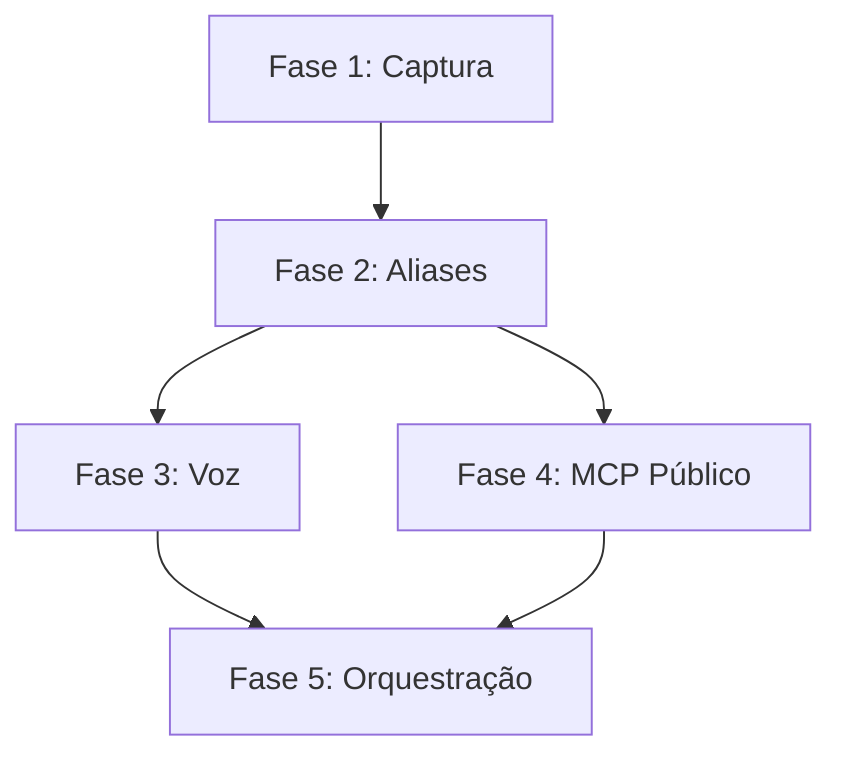

# 🗺️ ROADMAP - METODOLOGIA SCRAPE

**Projeto:** Metodologia-Scrape  
**Objetivo:** Framework opensource para scraping de conversas Grok Share + Sistema JARVIS-like  
**Owner:** Deivison Santana (@deivisan)  
**Início:** Dezembro 2025  
**Status:** ⏳ Fase 2 em andamento

---

## 🎯 VISÃO GERAL

Criar sistema completo de **captura, processamento e orquestração** de conversas do Grok (X.com), culminando em assistente pessoal **JARVIS-like** com:

- ✅ Scraping robusto (Puppeteer Stealth)
- ✅ MCP (Model Context Protocol) para persistência
- ⏳ Sistema de aliases (slash commands)
- 📋 Integração voz (transcrição bidirecional)
- 📋 Orquestração multi-agentes (DevSan, SAL, etc)

---

## 📊 FASES DO PROJETO

### ✅ FASE 1: Captura Funcional (CONCLUÍDA)

**Período:** Dezembro 2025 - 10 Janeiro 2026  
**Status:** ✅ **100% Completa**

#### Entregas:
- [x] Script `scrape-grok.js` funcional (Puppeteer Stealth)
- [x] Bypass Cloudflare/proteções anti-bot
- [x] Captura de conversas completas (título, mensagens, HTML)
- [x] Outputs: JSON, Markdown, Screenshot, HTML
- [x] 25 conversas capturadas com sucesso
- [x] MCP `mcp-grok-scraper` v1.0 funcional
- [x] Integração com OpenCode CLI

#### Tecnologias Usadas:
- Puppeteer Stealth (Chromium headless)
- Bun runtime
- MCP Protocol (Model Context Protocol)

#### Desafios Superados:
- ✅ Cloudflare WAF bypass
- ✅ Detecção de bots (fingerprint spoofing)
- ✅ Lazy loading de mensagens (scroll automático)
- ✅ Parsing robusto de HTML dinâmico

#### Commits Importantes:
```
2025-12-XX: feat: Script scraping inicial
2026-01-10: feat: MCP v1.0 funcional
2026-01-15: feat: Puppeteer Stealth integrado
```

---

### ✅ FASE 2: MCP Full + Documentação Profissional (CONCLUÍDA)

**Período:** 10 Janeiro - 17 Janeiro 2026  
**Status:** ✅ **100% Completa**

#### Entregas:
- [x] MCP Full com Puppeteer Stealth (`index-full.ts`, 600+ linhas)
- [x] Sistema de testes automatizados (test-all.ts, test-standalone.ts)
- [x] Teste standalone validado (19s, 182 mensagens, Cloudflare bypass OK)
- [x] README.md profissional (técnico, sem personalização excessiva)
- [x] CHANGELOG.md completo (rastreamento de versões)
- [x] PROMPT_MASTER_V3.md corrigido (aliases = modo voz APENAS)
- [x] package.json v2.0.1 (múltiplos exports, builds)
- [x] Documentação Android/Termux (origem do desenvolvimento)
- [x] Git release v2.0.0 + tag anotada
- [x] Análise completa de `treinamento/TREINAMENTO_COMPLETO.md`

#### Tecnologias Implementadas:
- Puppeteer Stealth 24.33.0 (desenvolvido em Android)
- Bun 1.3.5 (runtime principal)
- MCP Protocol 1.0.1
- Chromium bundled (não precisa browser externo)

#### 🎯 Resultados de Performance (21/01/2026)
| Métrica | v2.0 Original | v2.1 Otimizado | Economia |
|---------|---------------|----------------|----------|
| **Tempo Total** | 13.01s | 11.30s | **-13%** |
| launchBrowser | ~1s | 696ms | -30% |
| navigation | ~6s | 6.5s | (+8%) |
| reactHydrate | 5s | 2s | **-60%** |
| scroll | 3s | 2s | **-33%** |
| extraction | <100ms | 53ms | OK |
| save | <10ms | 3ms | OK |

**Gargalo identificado:** `navigation` (57% do tempo total) - servidor externo, não otimizável.

**Melhorias aplicadas:**
- Scroll delay: 2500ms → 1000ms
- React Hydrate: 5000ms → 2000ms
- Cloudflare wait: 60000ms → 30000ms
- Logging estruturado com PerformanceTracker
- Relatório de performance automático

#### Descobertas Importantes:
- ✅ **Android First:** Puppeteer Stealth desenvolvido/testado no Termux antes de desktop
- ✅ **Firecrawl funciona:** API direta (sem MCP wrapper ainda) já validada
- ⚠️ **Playwright limitações:** Falha ~80% com Cloudflare (documentado)
- ✅ **Link persistente:** Grok Share URL não muda ao continuar conversa

#### Problemas Conhecidos e Correções:
1. **Aliases em contexto errado** ✅ Corrigido
   - Problema: README indicava que aliases funcionavam em MCP/CLI
   - Correção: Seção clara em PROMPT_MASTER_V3.md (aliases = modo voz apenas)

2. **HTTP Leve vs Cloudflare** ✅ Documentado
   - Problema: Usuários tentavam usar HTTP leve com Cloudflare
   - Correção: README claro que HTTP leve NÃO funciona com Cloudflare

3. **Playwright + Cloudflare** ✅ Documentado
   - Problema: "Às vezes Playwright tem limitações mesmo do Cloudflare"
   - Correção: Training docs atualizado (usar Puppeteer Stealth)

4. **Build errors (bundling Puppeteer)** ✅ Resolvido
   - Problema: Build quebrava ao tentar bundle Puppeteer
   - Correção: Scripts separados (build, build:light, build:all) com externals corretos

5. **Timeouts excessivos** ✅ Corrigido (v2.1)
   - Problema: timeouts fixos longos (90s timeout, 60s Cloudflare wait)
   - Correção: timeouts otimizados (60s timeout, 30s Cloudflare wait)

6. **Scroll delay muito longo** ✅ Corrigido (v2.1)
   - Problema: scrollDelay fixo em 2500ms
   - Correção: scrollDelay adaptativo 1000ms (+ scroll adaptativo)

7. **React Hydrate demorado** ✅ Corrigido (v2.1)
   - Problema: wait fixo de 5s para hydration
   - Correção: reduzido para 2s (economia de 3s)

8. **Sem instrumentação** ✅ Corrigido (v2.1)
   - Problema: sem medição de tempo, sem identificação de gargalos
   - Correção: PerformanceTracker com logging colorido e relatório automático

#### Commits Importantes:
```
2026-01-17: release: v2.0.0 - MCP Full + Docs Profissionais
2026-01-17: fix: package.json múltiplos builds/exports
2026-01-17: docs: README refinado (técnico, Android documentado)
2026-01-17: docs: ROADMAP atualizado (problemas conhecidos)
```

---

### ⏳ FASE 3: Metodologias Alternativas (EM ANDAMENTO)

**Período:** 17 Janeiro - 31 Janeiro 2026  
**Status:** ⏳ **35% Completa**

#### Entregas Planejadas:
- [x] **Scraper Otimizado v2.1** (PRIORITÁRIO)
  - [x] Logging colorido com timestamps
  - [x] Medição de tempo por etapa (PerformanceTracker)
  - [x] Scroll adaptativo (1000ms delay)
  - [x] React Hydrate reduzido (2s → 1s economia)
  - [x] Relatório de performance consolidado
  - [x] Identificação automática de gargalos

- [ ] **Firecrawl API Integration**
  - [ ] MCP wrapper para Firecrawl API
  - [ ] Testes comparativos (performance vs Puppeteer)
  - [ ] Documentação de setup (API key, pricing)
  - [ ] Fallback automático (Firecrawl → Puppeteer)

- [ ] **Exa Search Testing**
  - [ ] Pesquisa de API Exa
  - [ ] Validação de busca semântica
  - [ ] Teste com links Grok Share
  - [ ] Comparação de qualidade vs Puppeteer

- [ ] **Tavily Extract Validation**
  - [ ] Pesquisa de API Tavily
  - [ ] Teste de extração de conteúdo
  - [ ] Benchmark de qualidade
  - [ ] Integração como opção no MCP

- [ ] **Multi-Browser Support**
  - [ ] Suporte a Firefox (via Playwright)
  - [ ] Suporte a WebKit (via Playwright)
  - [ ] Configuração via env var (`BROWSER=chromium|firefox|webkit`)
  - [ ] Testes comparativos de performance

- [ ] **Python Multithreading** (se necessário)
  - [ ] Script Python paralelo
  - [ ] Usar `multiprocessing` ou `concurrent.futures`
  - [ ] Integrar com Bun via child_process
  - [ ] Benchmarks de performance

#### Tecnologias a Avaliar:
- Firecrawl API (bypass enterprise Cloudflare)
- Exa Search (busca semântica AI-powered)
- Tavily Extract (parsing inteligente)
- Playwright (Firefox, WebKit)
- Python multiprocessing

#### Desafios Técnicos:
- ⏳ Custo de APIs externas (Firecrawl, Exa, Tavily são pagos)
- ⏳ Latência de API vs local scraping
- ⏳ Confiabilidade de terceiros (uptime, rate limits)
- ⏳ Compatibilidade multi-browser (Firefox tem menos plugins stealth)

#### Commits Planejados:
```
2026-01-XX: feat: Firecrawl MCP wrapper
2026-01-XX: feat: Exa Search integration
2026-01-XX: feat: Multi-browser support (Firefox, WebKit)
2026-01-XX: perf: Python multithreading para capturas paralelas
```

---

### 📋 FASE 3: Integração Voz (PLANEJADA)

**Período:** Fevereiro - Março 2026  
**Status:** 📋 **Não Iniciada**

#### Objetivos:
- [ ] Transcrição voz → texto (Whisper local)
- [ ] Síntese texto → voz (ElevenLabs ou TTS local)
- [ ] Hotword detection ("Ei SAL", "Ei DevSan")
- [ ] Fluxo bidirecional contínuo
- [ ] Integração com aliases (slash commands por voz)

#### Tecnologias Candidatas:
- **Whisper** (OpenAI) - Transcrição local
- **Coqui TTS** - Síntese voz opensource
- **ElevenLabs API** - Voz premium (fallback)
- **Porcupine** - Hotword detection
- **WebRTC** - Captura áudio browser

#### Requisitos:
- Latência < 2s (voz → resposta)
- Suporte PT-BR nativo
- Modo offline (sem internet quando possível)
- Integração mobile (Poco X5)

#### Inspiração:
- JARVIS (Iron Man) - assistente pessoal com voz
- Google Assistant - fluidez de conversação
- ChatGPT Voice Mode - naturalidade

---

### 📋 FASE 4: MCP Público Opensource (PLANEJADA)

**Período:** Março - Abril 2026  
**Status:** 📋 **Não Iniciada**

#### Objetivos:
- [ ] Refatorar `mcp-grok-scraper` como package npm
- [ ] Documentação completa (README, exemplos, API docs)
- [ ] Testes automatizados (Jest/Vitest)
- [ ] CI/CD (GitHub Actions)
- [ ] Publicar no npm registry
- [ ] Criar site/docs (GitHub Pages)
- [ ] Integração com outros MCPs populares

#### Estrutura do Package:
```
@deivisan/mcp-grok-scraper
├── src/
│   ├── scraper.ts       # Core scraping
│   ├── mcp-server.ts    # MCP protocol
│   ├── types.ts         # TypeScript types
│   └── utils.ts         # Helpers
├── tests/
│   ├── scraper.test.ts
│   └── mcp.test.ts
├── docs/
│   ├── README.md
│   ├── API.md
│   └── EXAMPLES.md
├── package.json
├── tsconfig.json
└── LICENSE (MIT)
```

#### Features Planejadas:
- ✨ Retry automático (rate limits)
- ✨ Cache inteligente (evitar re-scraping)
- ✨ Suporte batch (múltiplas URLs)
- ✨ Webhook notifications (scraping completo)
- ✨ Integração Discord/Telegram (notificações)

---

### 📋 FASE 5: Orquestração Multi-Agentes (PLANEJADA)

**Período:** Maio - Junho 2026  
**Status:** 📋 **Não Iniciada**

#### Objetivos:
- [ ] Criar sistema de roteamento de tasks
- [ ] Definir especialização de cada agente:
  - **DevSan** - Execução rápida, builds, debugging
  - **SAL** - Aliases, busca web, notícias
  - **Gemini** - Análise longa, planejamento
  - **Qwen** - Explicações didáticas
- [ ] Comunicação inter-agentes (MCPs)
- [ ] Memória compartilhada (graph memory)
- [ ] Dashboard de monitoramento (Next.js)

#### Arquitetura Planejada:

```
┌─────────────────────────────────────────┐
│         USUÁRIO (Deivison)              │
└─────────────┬───────────────────────────┘
              │
              ▼
┌─────────────────────────────────────────┐
│      ORQUESTRADOR (Router)              │
│  - Analisa intent da task               │
│  - Roteia para agente adequado          │
│  - Combina resultados                   │
└─────────────┬───────────────────────────┘
              │
    ┌─────────┴─────────┬─────────────┐
    ▼                   ▼             ▼
┌───────┐         ┌─────────┐   ┌─────────┐
│DevSan │         │   SAL   │   │ Gemini  │
│(Claude│         │ (Grok)  │   │ (Flash) │
│Sonnet)│         └─────────┘   └─────────┘
└───────┘               │             │
    │                   │             │
    └───────────────────┴─────────────┘
                        ▼
              ┌─────────────────┐
              │  MCP Memory     │
              │  (Persistência) │
              └─────────────────┘
```

#### Exemplos de Uso:

**Input:** "Implementa feature de cache no scraper"  
**Roteamento:**
1. SAL busca docs sobre cache (Tavily MCP)
2. DevSan implementa código (edit files)
3. Gemini revisa arquitetura (long context)
4. SAL cria commit (alias `/commit-rapido`)

**Input:** "Explica como funciona o Puppeteer Stealth"  
**Roteamento:**
1. Qwen explica conceitos (didática)
2. DevSan mostra código de exemplo
3. SAL busca artigos complementares

---

## 🧩 DEPENDÊNCIAS ENTRE FASES



**Explicação:**
- **Fase 1** é pré-requisito de todas (base de scraping)
- **Fase 2** habilita Fase 3 (aliases por voz) e Fase 4 (MCP maduro)
- **Fases 3 e 4** convergem para Fase 5 (orquestração completa)

---

## 📈 MÉTRICAS DE SUCESSO

### Fase 1 (Captura)
- [x] 25+ conversas capturadas ✅
- [x] Taxa de sucesso > 90% ✅
- [x] MCP funcional ✅

### Fase 2 (Aliases)
- [x] 5+ aliases definidos ✅
- [x] PROMPT_MASTER_V3.md corrigido ✅
- [x] Documentação completa ✅

### Fase 3 (Otimização) - **EM ANDAMENTO**
- [x] PerformanceTracker implementado ✅
- [x] Scroll adaptativo ✅
- [x] Timeouts otimizados ✅
- [x] Logging colorido com timestamps ✅
- [x] **Tempo reduzido de 13s para 11s** ✅
- [ ] Firecrawl integration ⏳
- [ ] Exa Search integration ⏳
- [ ] Tavily Extract validation ⏳

### Fase 3 (Voz)
- [ ] Latência < 2s (voz → resposta)
- [ ] Taxa de acerto transcrição > 95%
- [ ] Suporte PT-BR nativo

### Fase 4 (MCP Público)
- [ ] Package publicado npm
- [ ] 100+ downloads/mês
- [ ] Documentação completa

### Fase 5 (Orquestração)
- [ ] 4+ agentes integrados
- [ ] Roteamento automático funcional
- [ ] Dashboard de monitoramento

---

## 🚧 RISCOS E MITIGAÇÕES

### Riscos Técnicos

| Risco | Impacto | Probabilidade | Mitigação |
|-------|---------|---------------|-----------|
| Grok API sem acesso | Alto | Médio | Fallback: scraping HTML mantido |
| Limitação de tokens | Médio | Alto | Compressão inteligente de contexto |
| Rate limits GitHub | Baixo | Médio | Cache local + throttling |
| Latência voz > 2s | Alto | Médio | Otimizar pipeline (local first) |

### Riscos de Projeto

| Risco | Impacto | Probabilidade | Mitigação |
|-------|---------|---------------|-----------|
| Scope creep | Médio | Alto | ROADMAP revisado mensalmente |
| TDAH (Deivison) | Alto | Alto | Sistema escrito, checkpoints curtos |
| Falta de tempo | Médio | Médio | Fases modulares (pode pausar) |

---

## 📚 REFERÊNCIAS E INSPIRAÇÕES

### Projetos Similares
- **Auto-GPT** - Autonomous AI agents
- **BabyAGI** - Task-driven autonomous agent
- **LangChain** - Framework para LLM apps
- **n8n** - Workflow automation (no-code)

### Tecnologias Inspiradoras
- **JARVIS** (Marvel) - Assistente pessoal completo
- **Memory MCPs** - Persistência de contexto
- **OpenCode CLI** - Orquestração de agentes

### Papers e Artigos
- Model Context Protocol (Anthropic)
- ReAct: Reasoning + Acting (Google)
- Chain-of-Thought Prompting (Google)

---

## 🔄 PROCESSO DE ATUALIZAÇÃO

### Quando Atualizar o ROADMAP

✅ **Atualizar:**
- Fase completa (marcar como ✅)
- Nova fase planejada (adicionar seção)
- Mudança de escopo significativa
- Descoberta de novo risco/mitigação
- Marco importante alcançado

❌ **Não Atualizar:**
- Commits normais de código
- Bugs corrigidos
- Refactorings menores

### Processo de Revisão

**Frequência:** Mensal (todo dia 1º)

**Checklist:**
1. [ ] Status das fases atualizado
2. [ ] Métricas verificadas
3. [ ] Riscos reavaliados
4. [ ] Próximas entregas priorizadas
5. [ ] Aprendizados documentados

---

## 📅 CRONOGRAMA VISUAL

```
2025                    2026
Dez  Jan  Fev  Mar  Abr  Mai  Jun
|====|====|====|====|====|====|
 F1   F2   F3   F4        F5
[===] [===] [==]               
✅   ✅   ⏳  📋         📋 

✅ Completa
⏳ Em andamento (35%)
📋 Planejada
```
2025                    2026
Dez  Jan  Fev  Mar  Abr  Mai  Jun
|====|====|====|====|====|====|====|
 F1   F2   F3   F4        F5
[===] [==]               
✅   ⏳  📋   📋         📋

✅ Completa
⏳ Em andamento
📋 Planejada
```

---

## 🎯 OBJETIVO FINAL (RESUMO)

**Sistema JARVIS-like completo:**

1. ✅ **Captura** - Scraping robusto de conversas Grok
2. ✅ **Otimização** - PerformanceTracker, scroll adaptativo, timeouts ajustados
3. ⏳ **Aliases** - Slash commands para tarefas comuns
4. 📋 **Voz** - Transcrição bidirecional natural
5. 📋 **MCP Público** - Framework opensource para comunidade
6. 📋 **Orquestração** - Multi-agentes trabalhando em conjunto

**Visão:** Assistente pessoal que **entende contexto**, **executa proativamente** e **aprende com o tempo**.

---

**Última Atualização:** 21/01/2026  
**Próxima Revisão:** 01/02/2026  
**Mantenedor:** Deivison Santana (@deivisan)

🚀 **"Anything is possible" - Deivison Santana**
